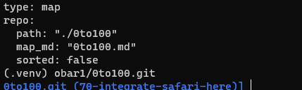
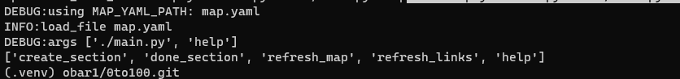
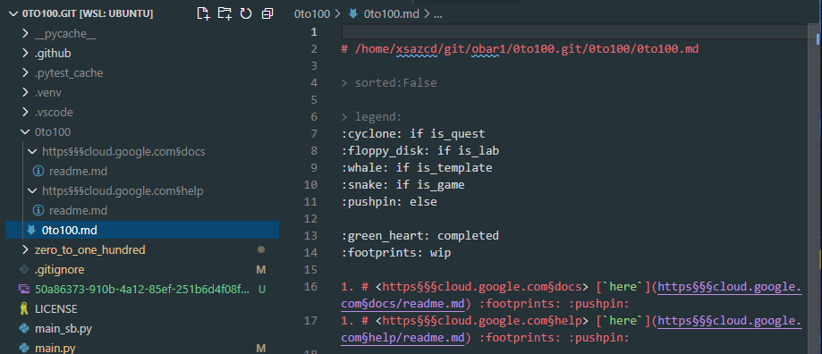
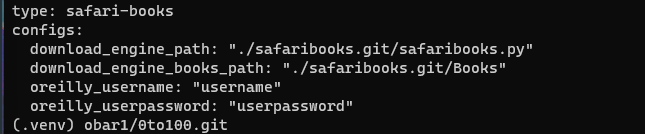
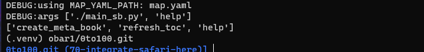
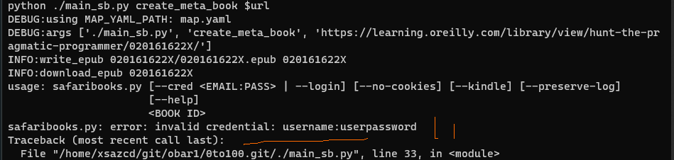
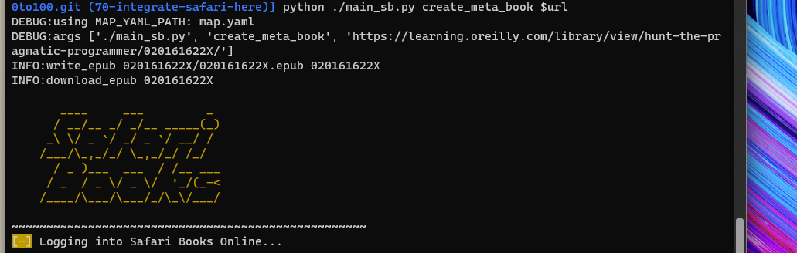
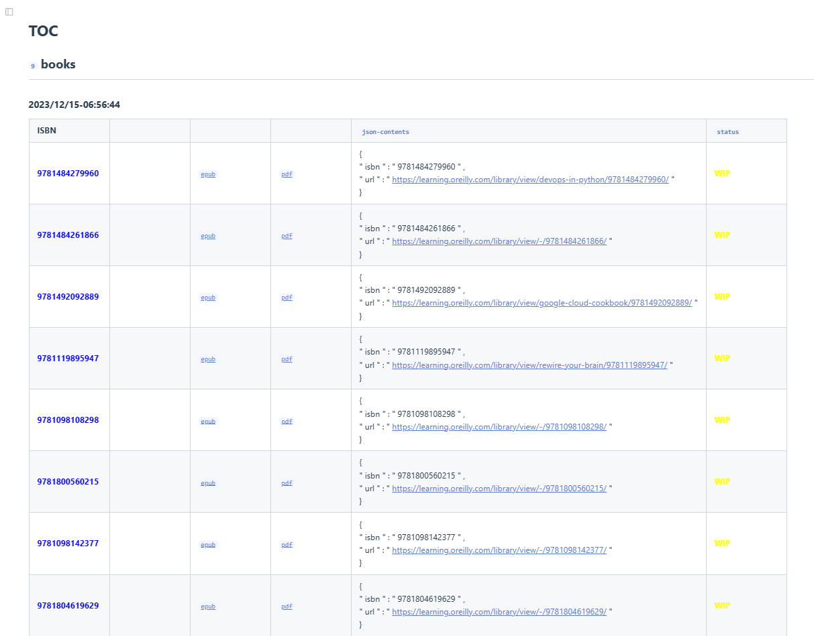

# readme

| SQ | CI |                                                                                                         
| -- | -- | 
| [](https://sonarcloud.io/summary/new_code?id=obar1_0to100) | [](https://github.com/obar1/0to100/actions/workflows/makefile.yml) | 

We read training material from the web and learn from it by doing, but how do we keep that a bit organized? I came up with an idea: this small tool.
Given a 'url', it creates the entry in a markdown map and a folder and links them; in this way, you can easily jump between different sections inside your preferred ide. As you expand the map with new contents, you build some reference material, keep it local all the time, and searchable all the time on your daily coding.

## quick demo

> in you want to check this quickly ...

[](https://codespaces.new/obar1/0to100?quickstart=1)

just open this repo in your GitHub Codespace and run the demo as:

```bash
pip install .
bash demo.sh 0to100
```



```bash
bash demo.sh 0to100_sb
```


## oto100

0 to 100 ... learn anything from webresources (and not)

current commands:
help:
['create_section', 'done_section', 'refresh_map', 'refresh_links', 'help']

> tip
in `create_section` you can override the default toc title adding another `#` hint below the one header created automatically in the section folder
ex
```markdown
# <https§§§www.cloudskillsboost.google§catalog>
> <https://www.cloudskillsboost.google/catalog>

# catalog
```
> tip
in `refresh_links` you can expand links from other sections automatically 
ex
```markdown
# <https§§§www.cloudskillsboost.google§catalog>
> <https://www.cloudskillsboost.google/catalog>

https://www.cloudskillsboost.google/doc
```
expand the last link to point to the section for the doc - handy as anchor tecnique 

### 1st time usage:

```bash
# env
python -m venv .venv
. .venv/bin/activate
pip install .

# copy sample yaml conf
cp ./zero_to_one_hundred/tests/resources/map.yaml .
cat map.yaml
export MAP_YAML_PATH=$(pwd)/map.yaml
# tip:  add it to .bash_rc etc or some shell script

```



```bash
chmod +x *.py
./main.py help
```



### daily usage:

- create new section

```bash
url=https://cloud.google.com/docs
./main.py create_section $url

url=https://cloud.google.com/help
./main.py create_section $url
#...etc
```



## oto100 safari books :construction:

0 to 100 ... learn anything from safari books https://learning.oreilly.com/member/login/

same as above but it can use some external lib to grab epub from oreilly

current commands:

help:
['create_meta_book', 'refresh_toc', 'help']

### 0th time usage:

> use what you prefer to  grab epub/pdf from oreilly 
check this 
https://github.com/lorenzodifuccia/safaribooks 
or just save as pdf section  by section with this 
https://chromewebstore.google.com/detail/reader-view/ecabifbgmdmgdllomnfinbmaellmclnh


### 1st time usage:

```bash
# env
python -m venv .venv
. .venv/bin/activate
pip install .

# copy sample yaml conf
cp ./zero_to_one_hundred/tests_sb/resources/map.yaml .
cat map.yaml
export MAP_YAML_PATH=$(pwd)/map.yaml
# tip:  add it to .bash_rc etc or some shell script
```



```bash
vim map.yaml
# add your membership details :)
```

```bash
chmod +x *.py
./main_sb.py help
```



### daily usage:

- create new meta-book

```bash
url=https://learning.oreilly.com/library/view/hunt-the-pragmatic-programmer/020161622X/
./main_sb.py create_meta_book $url
```

> add your membership details :) and it will work



> ex with mine :)



and you have a `toc.md` for free to use as your index (bookmark it)




