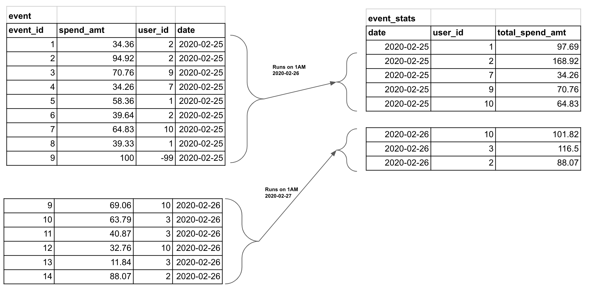

# <https§§§www.startdataengineering.com§post§how-to-schedule-a-sql-script-using-apache-airflow-with-an-example§>
> <https://www.startdataengineering.com/post/how-to-schedule-a-sql-script-using-apache-airflow-with-an-example/>

# Scheduling a SQL script, using Apache Airflow, with an example

sample data


use of mysql operator

```py
from airflow import DAG
from airflow.operators.mysql_operator import MySqlOperator

default_arg = {'owner': 'airflow', 'start_date': '2020-02-28'}

dag = DAG('simple-mysql-dag',
          default_args=default_arg,
          schedule_interval='0 0 * * *')

mysql_task = MySqlOperator(dag=dag,
                           mysql_conn_id='mysql_default', 
                           task_id='mysql_task'
                           sql='<path>/sample_sql.sql',
                           params={'test_user_id': -99})

mysql_task
```
HOWTO:
0 0 * * * is a cron schedule format
use this https://crontab.guru/

HOWTO:
def mysql_conn_id in
admin -> connections from airflow UI.

The SQL script to perform this operation is stored in a separate file sample_sql.sql.
[here](/https§§§www.startdataengineering.com§post§-to-schedule-a-sql-script-using-apache-airflow-with-an-example§/sample_sql.sql)

HOWTO:
The values within {{ }} are called templated parameters

Airflow macros: They provide access to the metadata that is available for each DAG run.
HOWTO:
more
https://airflow.apache.org/docs/apache-airflow/stable/templates-ref.html

Templated parameters: If we want our SQL script to have some parameters that can be filled at run time from the DAG, we can pass them as parameters to the task.