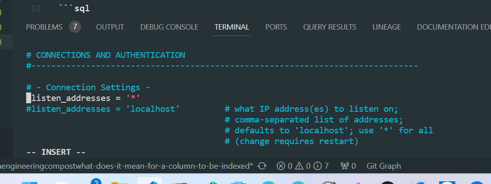
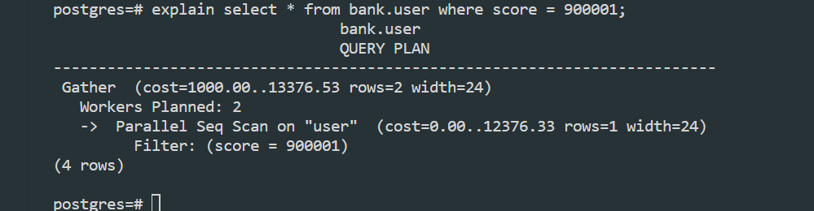
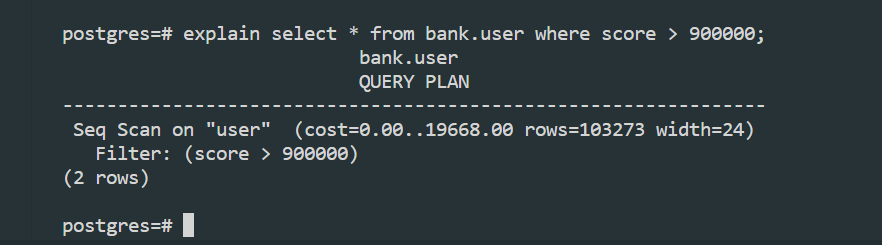
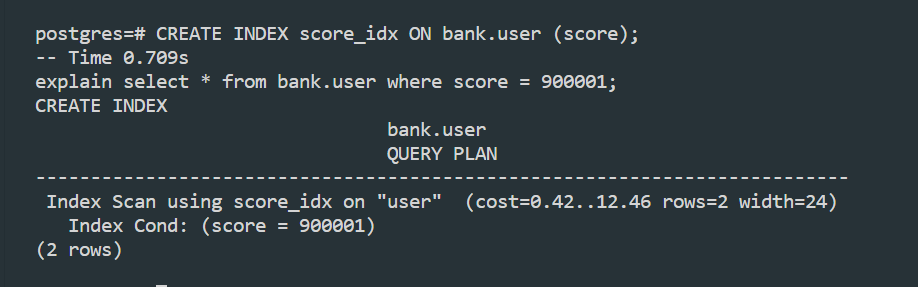
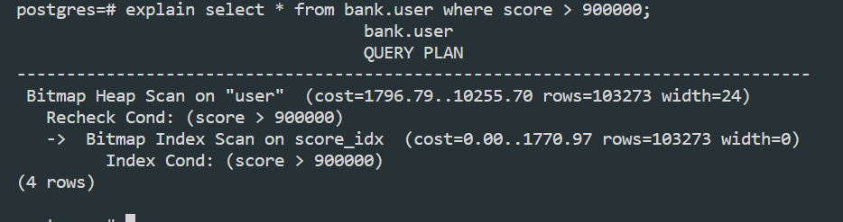
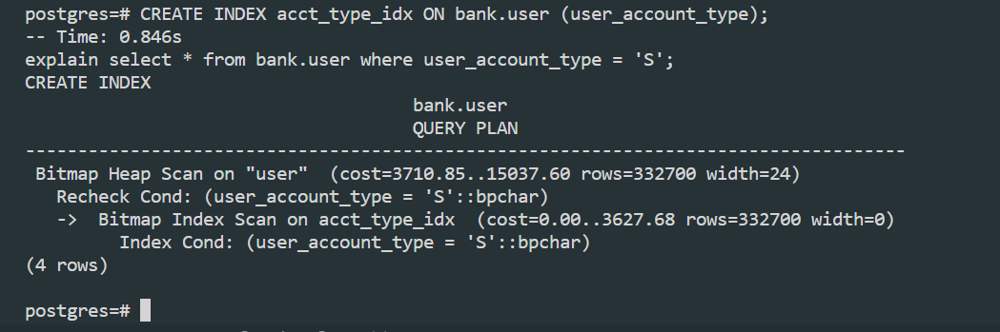

# <https§§§www.startdataengineering.com§post§what-does-it-mean-for-a-column-to-be-indexed§>
> <https://www.startdataengineering.com/post/what-does-it-mean-for-a-column-to-be-indexed/>

# What Does It Mean for a Column to Be Indexed

## Experiments

```bash
docker run --name pg_local -p 5432:5432 -e POSTGRES_USER=start_data_engineer \
-e POSTGRES_PASSWORD=password -e POSTGRES_DB=tutorial \
-v <your-data-folder-location>:/data -d postgres:12.2
```

INFO: data was copied from https://raw.githubusercontent.com/josephmachado/data/master/b_tree/user.csv to /data

[here](./000.sh)

HACK:

edit
```bash
sudo vi   /etc/postgresql/16/main/postgresql.conf 
```


and 
```bash
sudo service postgresql start
```
login and 
```bash
sudo -u postgres psql
```

```sql
CREATE SCHEMA bank;

SET search_path TO bank,public;

CREATE TABLE bank.user (
    user_id int,
    user_name varchar(50),
    score int,
    user_account_type char(1)
);

\COPY bank.user FROM './data/user.csv' DELIMITER ',' CSV HEADER;
```

Experiment 1

```
explain select * from bank.user where score = 900001;
```


Exp 2

```
explain select * from bank.user where score > 900000;
```



Ex 5

```
CREATE INDEX score_idx ON bank.user (score);
-- Time 0.709s
explain select * from bank.user where score = 900001;
```



```
explain select * from bank.user where score > 900000;
```



Ex8

```
CREATE INDEX acct_type_idx ON bank.user (user_account_type);
-- Time: 0.846s
explain select * from bank.user where user_account_type = 'S';
```
