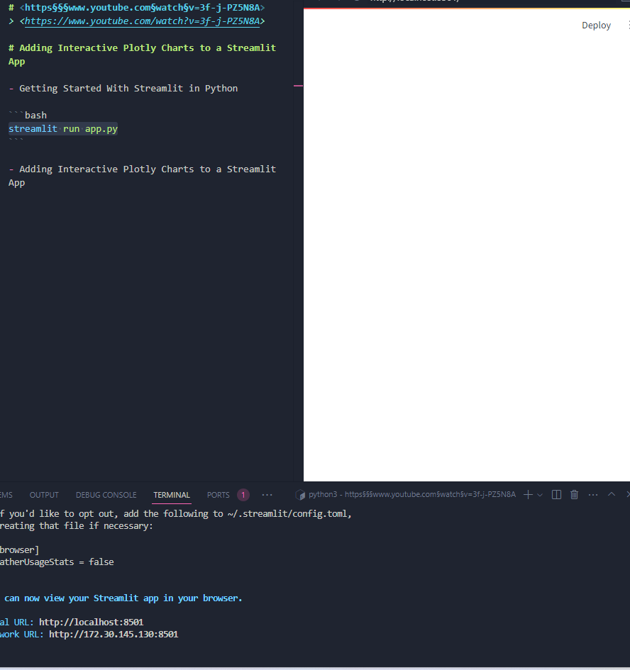
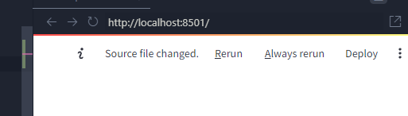
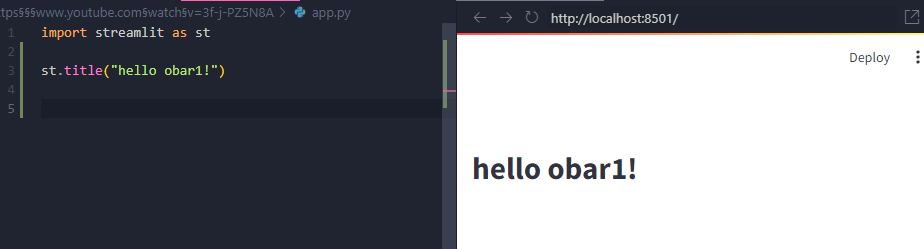
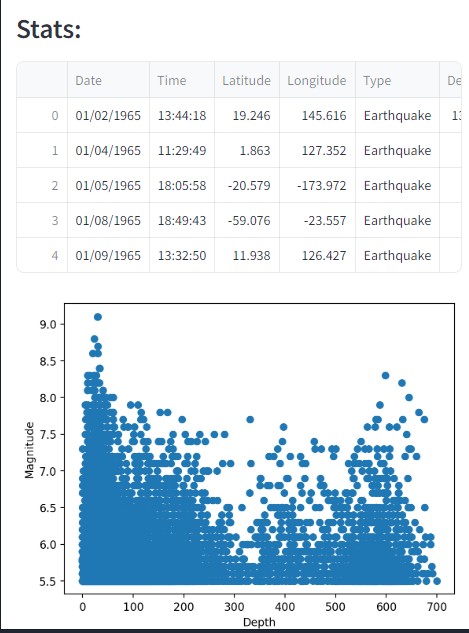
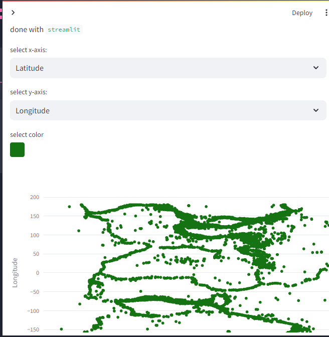

# <https§§§www.youtube.com§watch§v=3f-j-PZ5N8A>
> <https://www.youtube.com/watch?v=3f-j-PZ5N8A>

# Adding Interactive Plotly Charts to a Streamlit App

- Getting Started With Streamlit in Python

```bash
streamlit run app.py  --server.enableXsrfProtection false
```


change are found



simple refresh



get plot on




- Creating Multi-Page Streamlit Apps | Python Streamlit Series Part 2

add sidebar


- Adding Interactive Plotly Charts to a Streamlit App

add interactivity

final vers
